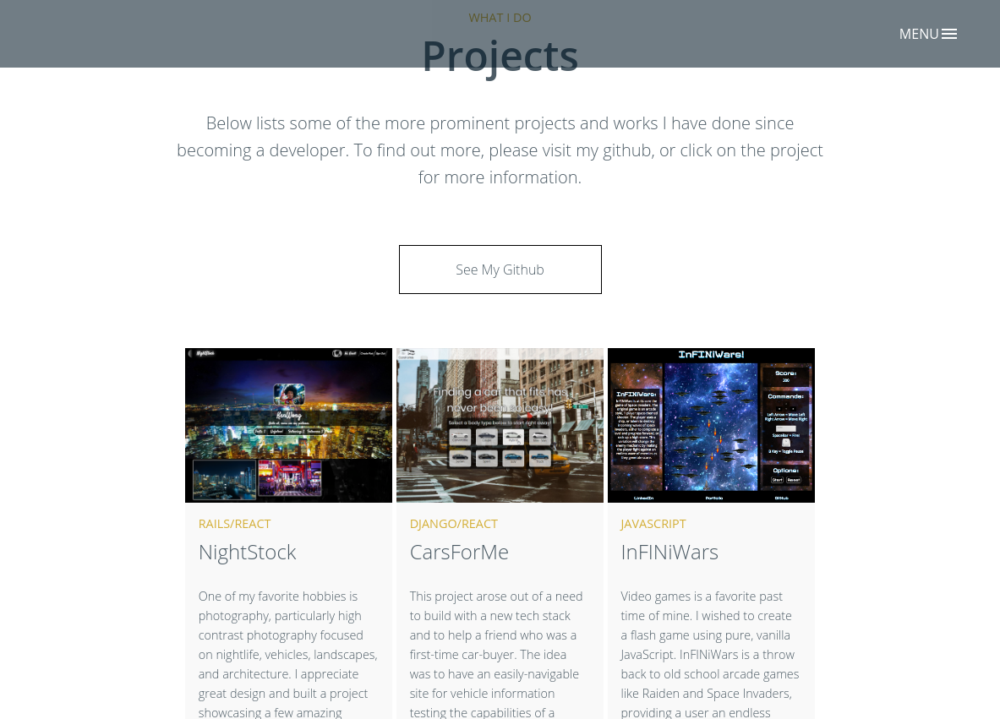

# Portfolio: Production

[Portfolio live][live]

[live]: http://www.akashpreetsingh.com
[diogodantas]: https://www.behance.net/gallery/20014792/Elegant-Free-HTML-PSD

This portfolio site was a revision and update to [Elegant][diogodantas], a website template for startups developed by Diogo Dantas in 2014. I combined various portions and features provided throughout the various pages on the template and revised them for a singular page portfolio site. I wished to continue the original intent of offering other users a template for their own use.





## Features


### Web Responsive and Mobile ready
The portfolio page itself is styled with ``@media`` tags for varying degrees of modern view ports and technology. I liked the responsiveness of Elegant and wished to bring it up to date for modern devices.

```css
  @media only screen and (min-width: 768px) {
    .cd-primary-nav {
      padding: 80px 0;
    }
  }
  @media only screen and (min-width: 1170px) {
    .cd-primary-nav li {
      font-size: 30px;
      font-size: 1.875rem;
    }
    .cd-primary-nav .cd-label {
      font-size: 16px;
      font-size: 1rem;
    }
  }

  @media all and (min-width: 320px) and (max-width: 780px) {
  	.cd-primary-nav a {
  	  font-size: 1.4rem;
  	  display: inline-block;
  	  padding: .4em 1em;
  	  border-radius: 0.25em;
  	  -webkit-transition: background 0.2s;
  	  -moz-transition: background 0.2s;
  	  transition: background 0.2s;
  	  color: rgb(212,175,55);
  	}
  }
```

### Modular Updates
Design is something I wished to simplify for others. In the case of a growing portfolio, I set up this webpage with the possibility to copy and paste various html elements in the projects section to allow for easy updates and additions. This allows for any user to keep their portfolio up-to-date with simple additions on the go, and not have to update any related CSS.


## Future Directions for the Project


### Addition of Technology Stack visuals
I plan to implement a responsive section for users to list various tech stacks their are strong and experienced in on the webpage. This will allow users to circumvent the need for visitors to see their resume.

### Addition of Hacker Challenge widgets
Similar to the feature above, I plan to implement and integrate various widgets for showcasing a user's scores/ratings on sites such as HackerRank, LeetCode, and others.
